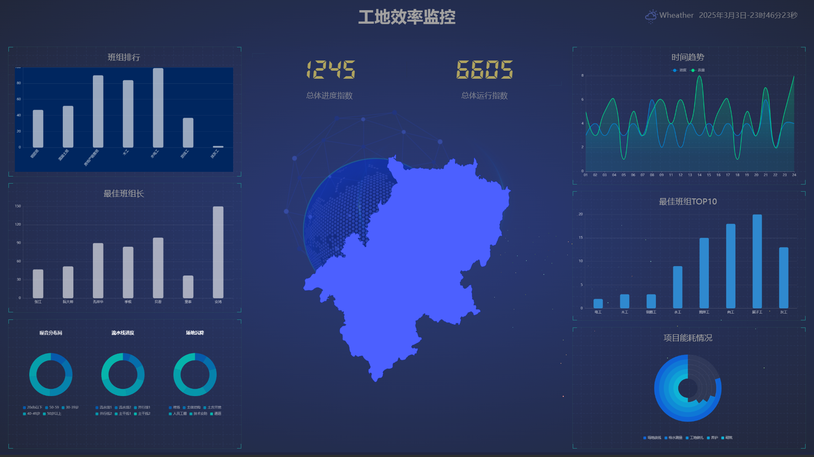
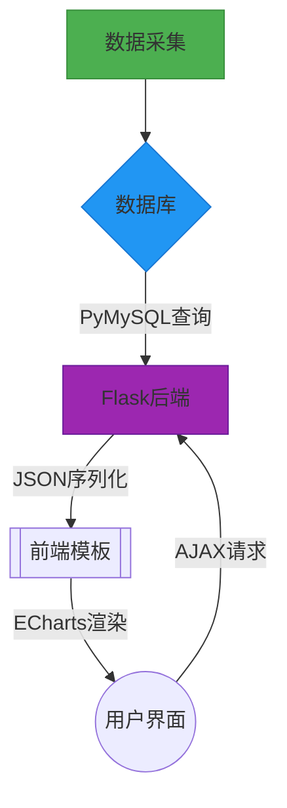
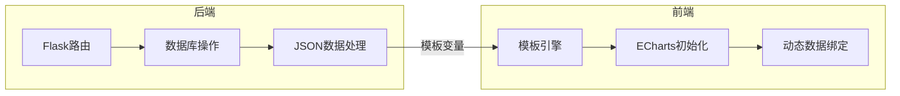

# Construction-detection

# **青岛二隧项目智慧施工监测可视化交互数据web - 项目文档**

## 项目概述

本项目是一个面向智慧工地团队的施工大数据可视化展示系统，旨在通过丰富的图表与交互界面提供实时的业务数据分析。系统的前端通过 **ECharts** 展示数据图表，后端与数据库进行实时交互，获取并展示各种业务指标。项目使用 **Flask** 后端框架，支持动态数据加载和渲染，前端通过与数据库的交互实时获取数据。

### 核心功能
- **数据可视化**：通过多种图表展示数据，如柱状图、折线图、饼图等。
- **实时更新**：前端数据与后端数据库交互，实时更新业务数据。
- **模块化设计**：前端和后端模块分离，保证了系统的可扩展性和易维护性。
---
## 功能亮点 
1. 动态双折线趋势图 
2. 实时指标看板 
3. 地理热力分布图 
 
## 系统架构 

---

## 项目结构

├── app.py # 主程序入口（Flask后端）
├── data.py 
├── models.py # 后端数据库交互模型 
├── templates/ 
│ ├── index.html # 前端页面模板 
├── static/ 
│ ├── css/ # 样式文件 
│ ├── js/ # JavaScript文件 
│ ├── picture/ # 图片资源 
├── requirements.txt # 项目依赖 
├── README.md # 项目文档


---

## 数据库设计与交互

### 1. 数据库设计概述

该系统的数据库设计包括多个表格，主要存储系统的业务数据、用户数据以及前端展示需要的数据。系统的核心是对不同的数据图表（如进度、质量、班组等）的支持。

#### 主要数据表：

- **echart4**：存储与时间趋势相关的数据（如进度和质量）。
- **counter**：存储总体进度、运行指数等。
- **map**：存储与地理信息相关的数据。
  
### 2. 布局与ER流程图设计

以下是数据库设计的 **概览图**，展示了不同数据表之间的布局

#### 数据库概览图



- **echart4**：存储与时间趋势相关的数据，每个条目都包含多个字段（如 `name`, `value`）。
- **counter**：用于存储各类计数器（进度、质量等）的数据。
- **map**：用于存储地图和相关数据，支持前端的地理展示功能。


---

### 3. 数据库交互

#### 3.1 数据库连接与查询

后端通过 `Flask` 框架与数据库进行交互，以下是连接和查询的关键代码。

```python
import pymysql

def get_db_connection():
    connection = pymysql.connect(
        host='localhost',
        user='your_mysql_user',
        password='your_mysql_password',
        database='dashboard_data',
        charset='utf8mb4',
        cursorclass=pymysql.cursors.DictCursor
    )
    return connection

@app.route('/')
def index():
    connection = get_db_connection()
    cursor = connection.cursor()

    cursor.execute("SELECT name, value FROM echart4")
    echart4_data = cursor.fetchall()

    cursor.close()
    connection.close()

    return render_template('index.html', form=echart4_data)

在此代码中，get_db_connection 函数用于创建数据库连接并查询相关数据表（如 echart4 表）。返回的数据通过 Flask 模板渲染到前端。

### 4. 数据处理与前端交互
#### 前端通过 ECharts 展示从后端获取的数据，数据从后端返回后以 JSON 格式加载并呈现。例如，在图表中显示进度和质量的时间趋势
option = {
    tooltip: { trigger: 'axis', axisPointer: { type: 'shadow' } },
    xAxis: [{ type: 'category', data: {{ form.echart4.xAxis|safe }} }],
    yAxis: [{ type: 'value' }],
    series: [{
        name: '进度',
        type: 'line',
        data: {{ form.echart4.data[0].value|safe }},
        itemStyle: { color: '#c23531' }
    }, {
        name: '质量',
        type: 'line',
        data: {{ form.echart4.data[1].value|safe }},
        itemStyle: { color: '#2f89cf' }
    }]
};

该部分代码将在前端展示两条折线图，分别表示进度和质量的变化趋势。
```


## Installation

To run the app flawlessly, satisfy the requirements
```bash
$ pip install -r requirements.txt
```

## Set Environment Variables
```bash
$ export FLASK_APP=app.py
$ export FLASk_ENV=development
```

## Start Server
```bash
$ python -m flask app.py
```


## 配置数据库
创建数据库 dashboard_data，并运行以下 SQL 脚本初始化数据表：

-- 创建核心表结构 
CREATE TABLE echart4 (
    id INT AUTO_INCREMENT PRIMARY KEY,
    name VARCHAR(255),
    value JSON,
    xAxis JSON 
);
 
-- 其他表结构详见dashborad_data.sql...


